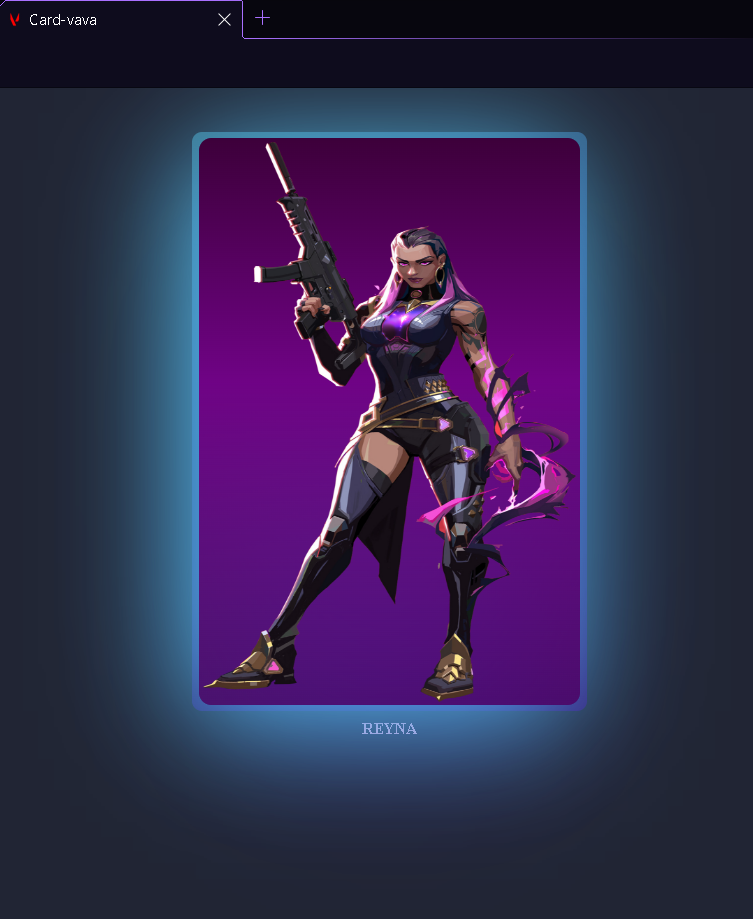

# CARD-VALORANT

# Sobre o projeto

## Projeto de um card para receber os personagens da API de Valorant

## Layout principal

 


# Tecnologias utilizadas

- HTML / CSS 

# Como executar o projeto

```bash
# clonar repositório
https://github.com/JGMeneses/Card-valorant.git
# indico o VScode e sua extensão GOlive

```

# Autor

João Victor Gomes Meses
